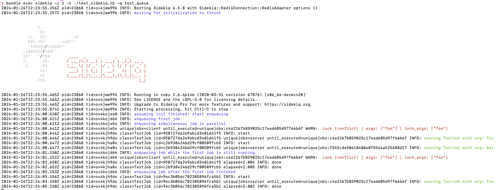

## Overview

Test script for testing concurrent jobs, locking and unique-jobs 

### Usage

install gems
```shell
bundle install
```

run sidekiq test script
- `c` is concurrency (2 or more to test parallel jobs) 
- `r` is require
- `q` is queue
 
```shell
bundle exec sidekiq -c 2 -r ./test_sidekiq.rb -q test_queue
```



### Links
- https://github.com/mhenrixon/sidekiq-unique-jobs
